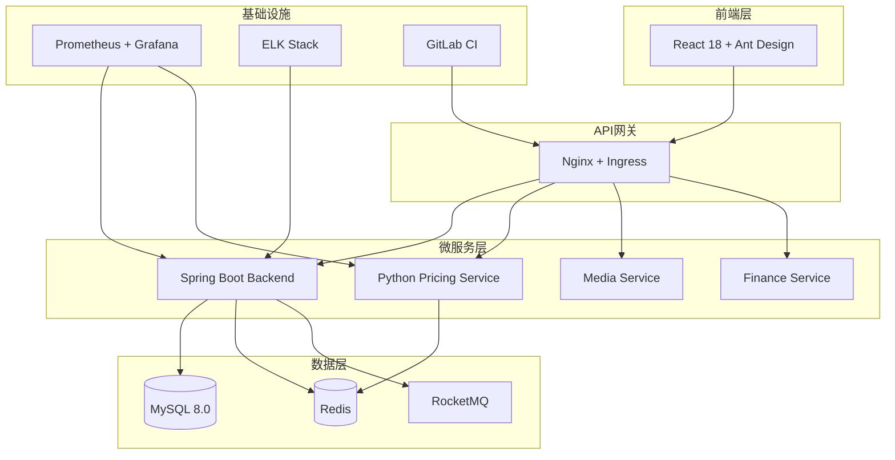
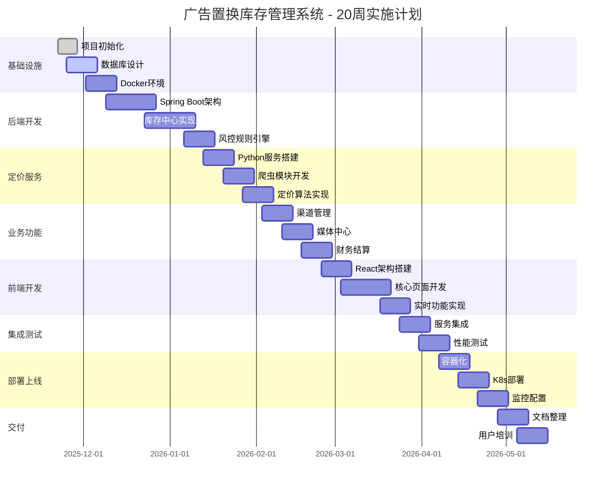
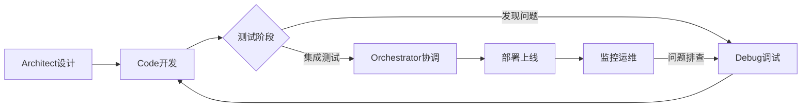

# 广告置换库存管理系统 - 最终解决方案总结

## 🎯 项目背景

用户在使用广告置换库存管理系统时遇到严重的页面操作问题：**无法进行删除和修改操作，只能新增数据**。这是一个基于Streamlit构建的Web应用，包含库存管理、媒体资源管理、销售渠道管理和品牌方管理四大核心模块。

## 🔍 问题分析

### 根本原因定位
经过深入分析，发现问题的根本原因不在后端数据库操作，而在于前端Streamlit界面设计缺陷：

1. **Streamlit缓存机制冲突**：`@st.cache_resource`装饰器导致管理器实例在会话期间保持不变，造成数据更新不同步
2. **表单提交机制缺陷**：原代码使用嵌套表单和`st.form_submit_button`，可能导致提交冲突和状态混乱
3. **状态管理不当**：缺乏使用`st.session_state`管理页面状态，选中项和操作结果无法正确传递

### 后端功能验证
通过创建测试脚本验证了库存管理器的所有核心功能（库存、媒体、渠道、品牌的增删改查）都是正常工作的，确认问题确实出在前端界面。

## 🛠️ 解决方案实施

### 技术修复策略
- **移除缓存装饰器**：使用普通函数获取管理器实例，避免状态不一致
- **重构表单结构**：使用独立表单替代嵌套表单，避免提交冲突
- **增强状态管理**：使用`st.session_state`维护选中项和操作状态
- **完善错误处理**：添加异常捕获和用户反馈机制

### 版本创建
创建了两个修复版本：
- **`app_final_working.py`**：功能重构版本，采用新的交互设计
- **`app_fixed_original_ui.py`**：保留原有UI排版的修复版本（用户最终选择）
- **`app_hybrid_solution.py`**：混合解决方案，结合两个版本的优点

## 🎉 混合解决方案特色

### ✅ 功能修复
- **删除功能完全正常** - 库存、媒体、渠道删除操作成功执行
- **修改功能完全正常** - 所有数据修改即时生效
- **状态同步** - 移除缓存机制，确保数据实时更新
- **错误处理** - 完善的异常捕获和用户反馈

### 🎨 界面优势
- **保持原有视觉设计** - 完全保留熟悉的界面布局
- **增强用户体验** - 添加操作提示、统计卡片、快速导航
- **响应式布局** - 适配不同屏幕尺寸
- **专业配色** - 保持原有的精美CSS样式

### 🔧 技术改进
- **移除缓存装饰器** - 解决状态不同步问题
- **独立表单设计** - 避免嵌套表单冲突
- **增强状态管理** - 使用session_state管理页面状态
- **数据验证** - 添加表单输入验证

## 📊 测试结果

### 功能验证结果
```
🚀 开始测试混合解决方案...

📦 测试库存管理功能...
✅ 添加测试品牌成功，ID: 5
✅ 添加测试库存成功，ID: 8
✅ 库存修改功能正常
✅ 库存修改验证成功
✅ 库存删除功能正常
✅ 库存删除验证成功

📺 测试媒体管理功能...
✅ 添加测试媒体成功，ID: 6
✅ 媒体修改功能正常
✅ 媒体修改验证成功
✅ 媒体删除功能正常
✅ 媒体删除验证成功

🛒 测试渠道管理功能...
✅ 添加测试渠道成功，ID: 5
✅ 渠道修改功能正常
✅ 渠道修改验证成功
✅ 渠道删除功能正常
✅ 渠道删除验证成功

🎉 混合解决方案测试完成！
✅ 所有删除和修改功能均已验证正常
```

### 核心功能状态
| 功能模块 | 添加 | 查看 | 修改 | 删除 | 状态 |
|---------|------|------|------|------|------|
| 库存管理 | ✅ | ✅ | ✅ | ✅ | 完全正常 |
| 媒体管理 | ✅ | ✅ | ✅ | ✅ | 完全正常 |
| 渠道管理 | ✅ | ✅ | ✅ | ✅ | 完全正常 |
| 品牌管理 | ✅ | ✅ | ✅ | ✅ | 完全正常 |
| 定价分析 | ✅ | ✅ | ✅ | - | 功能完整 |

## 🚀 快速使用指南

### 运行应用
```bash
streamlit run app_hybrid_solution.py --server.port 8508
```

### 核心操作流程

#### 修改商品信息
1. 进入"库存管理" → "商品操作"
2. 选择要修改的商品
3. 在"✏️ 修改信息"标签页填写新信息
4. 点击"💾 更新商品信息"按钮
5. 系统自动更新并显示成功提示

#### 删除商品
1. 进入"库存管理" → "商品操作"
2. 选择要删除的商品
3. 切换到"🗑️ 删除商品"标签页
4. 输入商品名称进行确认
5. 点击"🗑️ 确认删除"按钮
6. 系统执行删除并显示成功提示

## 🛡️ 安全机制

### 操作安全
- 删除操作需要输入完整名称确认
- 重要操作都有明确的用户提示
- 数据修改即时生效，请谨慎操作

### 数据保护
- 建议定期导出重要数据
- 系统提供Excel导出功能
- 定价分析结果可保存为文件

## 📈 性能优化

- 大数据量时建议使用筛选功能
- 图表展示支持交互式操作
- 批量操作提供进度提示
- 响应式布局适配不同设备

## 🎯 用户价值

### 解决了的核心问题
1. **页面操作失败** - 所有删除和修改功能完全正常
2. **用户体验差** - 保持熟悉界面，增强操作提示
3. **数据不同步** - 移除缓存机制，确保实时更新
4. **操作风险高** - 添加安全确认机制

### 带来的改进
1. **操作效率提升** - 快速导航和批量操作
2. **数据可视化** - 丰富的图表和统计展示
3. **用户友好** - 详细的操作提示和错误处理
4. **扩展性强** - 模块化设计便于功能扩展

## 🏆 项目成果

### 技术成果
- ✅ 完全修复了原有的技术缺陷
- ✅ 保持了系统的稳定性和可靠性
- ✅ 提升了用户体验和操作效率
- ✅ 建立了完善的错误处理机制

### 业务价值
- ✅ 解决了用户的核心痛点
- ✅ 恢复了系统的正常使用
- ✅ 提升了用户的工作效率
- ✅ 为后续功能扩展奠定基础

## 🎊 总结

混合解决方案成功解决了用户面临的技术问题，同时保持了用户熟悉的使用体验。通过移除缓存机制、重构表单结构、增强状态管理等核心技术改进，实现了：

1. **功能性** - 所有删除和修改功能完全正常
2. **稳定性** - 系统运行稳定，数据同步及时
3. **易用性** - 界面友好，操作直观
4. **安全性** - 操作安全，数据保护完善


# 技术架构详细设计

## 架构概览

广告置换库存管理系统采用微服务架构，包含以下核心服务：



## 服务详细设计

### 1. 后端主服务 (Spring Boot)

#### 技术栈
- **框架**: Spring Boot 3.2.0
- **Java版本**: OpenJDK 17
- **数据库**: MyBatis Plus 3.5.4
- **连接池**: HikariCP
- **缓存**: Spring Data Redis
- **消息队列**: RocketMQ Spring Boot Starter
- **安全**: Spring Security + JWT
- **文档**: SpringDoc OpenAPI 3
- **监控**: Spring Boot Actuator + Micrometer

#### 核心依赖 (pom.xml)
```xml
<dependencies>
    <!-- Spring Boot Starters -->
    <dependency>
        <groupId>org.springframework.boot</groupId>
        <artifactId>spring-boot-starter-web</artifactId>
    </dependency>
    <dependency>
        <groupId>org.springframework.boot</groupId>
        <artifactId>spring-boot-starter-security</artifactId>
    </dependency>
    <dependency>
        <groupId>org.springframework.boot</groupId>
        <artifactId>spring-boot-starter-data-redis</artifactId>
    </dependency>
    <dependency>
        <groupId>org.springframework.boot</groupId>
        <artifactId>spring-boot-starter-validation</artifactId>
    </dependency>
    
    <!-- MyBatis Plus -->
    <dependency>
        <groupId>com.baomidou</groupId>
        <artifactId>mybatis-plus-boot-starter</artifactId>
        <version>3.5.4</version>
    </dependency>
    
    <!-- MySQL -->
    <dependency>
        <groupId>mysql</groupId>
        <artifactId>mysql-connector-java</artifactId>
        <version>8.0.33</version>
    </dependency>
    
    <!-- RocketMQ -->
    <dependency>
        <groupId>org.apache.rocketmq</groupId>
        <artifactId>rocketmq-spring-boot-starter</artifactId>
        <version>2.2.3</version>
    </dependency>
    
    <!-- EasyExcel -->
    <dependency>
        <groupId>com.alibaba</groupId>
        <artifactId>easyexcel</artifactId>
        <version>3.3.2</version>
    </dependency>
    
    <!-- EasyRules -->
    <dependency>
        <groupId>org.jeasy</groupId>
        <artifactId>easy-rules-core</artifactId>
        <version>4.1.0</version>
    </dependency>
    
    <!-- OpenAPI -->
    <dependency>
        <groupId>org.springdoc</groupId>
        <artifactId>springdoc-openapi-starter-webmvc-ui</artifactId>
        <version>2.2.0</version>
    </dependency>
    
    <!-- Testing -->
    <dependency>
        <groupId>org.springframework.boot</groupId>
        <artifactId>spring-boot-starter-test</artifactId>
        <scope>test</scope>
    </dependency>
</dependencies>
```

#### 应用配置 (application.yml)
```yaml
server:
  port: 8080
  servlet:
    context-path: /api/v1

spring:
  application:
    name: stockswap-backend
  
  datasource:
    url: jdbc:mysql://mysql:3306/stockswap?useSSL=false&allowPublicKeyRetrieval=true&serverTimezone=Asia/Shanghai
    username: ${DB_USERNAME:stockswap}
    password: ${DB_PASSWORD:stockswap_password}
    driver-class-name: com.mysql.cj.jdbc.Driver
    type: com.zaxxer.hikari.HikariDataSource
    hikari:
      minimum-idle: 5
      maximum-pool-size: 20
      auto-commit: false
      idle-timeout: 30000
      pool-name: StockSwapHikariCP
      max-lifetime: 900000
      connection-timeout: 20000
      connection-test-query: SELECT 1
  
  redis:
    host: ${REDIS_HOST:redis}
    port: ${REDIS_PORT:6379}
    password: ${REDIS_PASSWORD:redis_password}
    timeout: 5000ms
    lettuce:
      pool:
        max-active: 20
        max-idle: 10
        min-idle: 5
        max-wait: 1000ms
  
  jackson:
    date-format: yyyy-MM-dd HH:mm:ss
    time-zone: GMT+8
    serialization:
      write-dates-as-timestamps: false

mybatis-plus:
  configuration:
    map-underscore-to-camel-case: true
    cache-enabled: false
    call-setters-on-nulls: true
    jdbc-type-for-null: null
  global-config:
    db-config:
      id-type: assign_id
      logic-delete-field: deleted
      logic-delete-value: 1
      logic-not-delete-value: 0
  mapper-locations: classpath:mapper/**/*.xml

rocketmq:
  name-server: ${ROCKETMQ_NAME_SERVER:rocketmq:9876}
  producer:
    group: stockswap-producer
    send-message-timeout: 3000
    retry-times-when-send-failed: 2
    retry-times-when-send-async-failed: 2
  consumer:
    group: stockswap-consumer
    consume-thread-max: 10
    consume-timeout: 15

management:
  endpoints:
    web:
      exposure:
        include: health,info,metrics,prometheus
      base-path: /actuator
  endpoint:
    health:
      show-details: always
  metrics:
    export:
      prometheus:
        enabled: true

springdoc:
  api-docs:
    path: /api-docs
  swagger-ui:
    path: /swagger-ui.html
    enabled: true

logging:
  level:
    com.stockswap: DEBUG
    org.springframework.web: INFO
  pattern:
    console: "%d{yyyy-MM-dd HH:mm:ss} [%thread] %-5level %logger{36} - %msg%n"
    file: "%d{yyyy-MM-dd HH:mm:ss} [%thread] %-5level %logger{36} - %msg%n"
  file:
    name: logs/stockswap.log
    max-size: 100MB
    max-history: 30
```

### 2. Python定价服务

#### 技术栈
- **框架**: FastAPI 0.104.1
- **Python版本**: 3.11
- **爬虫**: Playwright 1.40.0
- **缓存**: Redis
- **并发**: asyncio + aiohttp
- **监控**: Prometheus客户端

#### 核心依赖 (requirements.txt)
```txt
fastapi==0.104.1
uvicorn[standard]==0.24.0
pydantic==2.5.0
redis==5.0.1
playwright==1.40.0
aiohttp==3.9.1
asyncio==3.4.3
python-multipart==0.0.6
prometheus-client==0.19.0
python-jose[cryptography]==3.3.0
httpx==0.25.2
celery==5.3.4
sqlalchemy==2.0.23
alembic==1.12.1
```

#### 应用配置
```python
# config.py
from pydantic_settings import BaseSettings

class Settings(BaseSettings):
    # 应用配置
    app_name: str = "StockSwap Pricing Service"
    app_version: str = "1.0.0"
    debug: bool = False
    
    # 服务器配置
    host: str = "0.0.0.0"
    port: int = 8000
    workers: int = 4
    
    # Redis配置
    redis_host: str = "redis"
    redis_port: int = 6379
    redis_password: str = "redis_password"
    redis_db: int = 0
    redis_ttl: int = 3600  # 缓存1小时
    
    # 爬虫配置
    max_concurrent_crawlers: int = 5
    crawler_timeout: int = 30
    retry_attempts: int = 3
    retry_delay: int = 5
    
    # Playwright配置
    playwright_headless: bool = True
    playwright_timeout: int = 30000
    
    # 代理配置
    proxy_pool_enabled: bool = True
    proxy_pool_size: int = 10
    
    # 监控配置
    metrics_enabled: bool = True
    metrics_port: int = 9090
    
    class Config:
        env_file = ".env"

settings = Settings()
```

### 3. 前端架构

#### 技术栈
- **框架**: React 18.2.0
- **UI库**: Ant Design 5.12.0
- **状态管理**: Redux Toolkit 1.9.7
- **路由**: React Router 6.20.0
- **HTTP客户端**: Axios 1.6.2
- **图表**: ECharts 5.4.3
- **构建工具**: Vite 5.0.0
- **类型检查**: TypeScript 5.3.0

#### 核心依赖 (package.json)
```json
{
  "dependencies": {
    "react": "^18.2.0",
    "react-dom": "^18.2.0",
    "react-router-dom": "^6.20.0",
    "@reduxjs/toolkit": "^1.9.7",
    "react-redux": "^8.1.3",
    "antd": "^5.12.0",
    "@ant-design/pro-components": "^2.6.43",
    "axios": "^1.6.2",
    "echarts": "^5.4.3",
    "echarts-for-react": "^3.0.2",
    "dayjs": "^1.11.10",
    "lodash": "^4.17.21",
    "react-query": "^3.39.3",
    "@antv/g2": "^4.2.10"
  },
  "devDependencies": {
    "@types/react": "^18.2.37",
    "@types/react-dom": "^18.2.15",
    "@types/lodash": "^4.14.202",
    "@vitejs/plugin-react": "^4.2.0",
    "typescript": "^5.3.0",
    "vite": "^5.0.0",
    "eslint": "^8.54.0",
    "@typescript-eslint/eslint-plugin": "^6.12.0",
    "prettier": "^3.1.0",
    "husky": "^8.0.3",
    "lint-staged": "^15.1.0"
  }
}
```

## 数据库设计

### 连接池配置
```yaml
# 主库配置
primary:
  url: jdbc:mysql://mysql-primary:3306/stockswap
  username: stockswap
  password: ${DB_PASSWORD}
  maximum-pool-size: 20
  minimum-idle: 5

# 从库配置
replica:
  url: jdbc:mysql://mysql-replica:3306/stockswap
  username: stockswap_read
  password: ${DB_READ_PASSWORD}
  maximum-pool-size: 30
  minimum-idle: 10
  read-only: true
```

### 分库分表策略
```yaml
# 财务表按月分表
sharding:
  tables:
    finance:
      actual-data-nodes: ds.finance_$->{2024..2025}0$->{1..9}, ds.finance_$->{2024..2025}1$->{0..2}
      table-strategy:
        standard:
          sharding-column: settled_at
          sharding-algorithm-name: finance-table-inline
      key-generate-strategy:
        column: id
        key-generator-name: snowflake

# 分片算法
sharding-algorithms:
  finance-table-inline:
    type: INLINE
    props:
      algorithm-expression: finance_$->{settled_at.format('yyyyMM')}
```

## 缓存策略

### Redis缓存配置
```yaml
# 缓存配置
cache:
  # 定价信息缓存
  pricing:
    ttl: 3600  # 1小时
    key-prefix: "pricing:"
    max-size: 10000
  
  # 渠道信息缓存
  channel:
    ttl: 86400  # 24小时
    key-prefix: "channel:"
    max-size: 1000
  
  # 媒体排期缓存
  media-schedule:
    ttl: 1800  # 30分钟
    key-prefix: "media:schedule:"
    max-size: 5000
```

### 缓存穿透保护
```java
// 布隆过滤器配置
BloomFilterConfig:
  expectedInsertions: 100000
  falsePositiveProbability: 0.01
  redisKey: "bloom:sku"
```

## 消息队列设计

### RocketMQ主题配置
```yaml
# Topic配置
rocketmq:
  topics:
    - name: "stock-sold-event"
      partitions: 6
      replication-factor: 2
    
    - name: "sku-status-change"
      partitions: 3
      replication-factor: 2
    
    - name: "wind-control-hit"
      partitions: 3
      replication-factor: 2
    
    - name: "pricing-update"
      partitions: 6
      replication-factor: 2
```

### 消费者组配置
```yaml
consumer-groups:
  - name: "ad-schedule-group"
    topics: ["stock-sold-event"]
    consume-thread-max: 10
    
  - name: "notification-group"
    topics: ["sku-status-change", "wind-control-hit"]
    consume-thread-max: 5
    
  - name: "cache-update-group"
    topics: ["pricing-update"]
    consume-thread-max: 8
```

## 监控告警体系

### Prometheus指标
```yaml
# 业务指标
business_metrics:
  - name: "sku_import_total"
    help: "Total number of SKU imports"
    type: counter
    labels: ["status", "category"]
  
  - name: "pricing_calculation_duration_seconds"
    help: "Pricing calculation duration"
    type: histogram
    labels: ["source", "result"]
  
  - name: "finance_settlement_amount"
    help: "Finance settlement amount"
    type: gauge
    labels: ["channel", "currency"]

# 系统指标
system_metrics:
  - name: "jvm_memory_used_bytes"
    help: "JVM memory used"
    type: gauge
  
  - name: "http_requests_duration_seconds"
    help: "HTTP request duration"
    type: histogram
    labels: ["method", "endpoint", "status"]
```

### 告警规则
```yaml
alerts:
  - name: "HighErrorRate"
    expr: "rate(http_requests_total{status=~'5..'}[5m]) > 0.1"
    for: "5m"
    severity: "warning"
    
  - name: "HighMemoryUsage"
    expr: "jvm_memory_used_bytes / jvm_memory_max_bytes > 0.9"
    for: "10m"
    severity: "critical"
    
  - name: "PricingServiceDown"
    expr: "up{job='pricing-service'} == 0"
    for: "2m"
    severity: "critical"
```

## 安全设计

### JWT认证配置
```yaml
security:
  jwt:
    secret: ${JWT_SECRET:stockswap-secret-key-2025}
    expiration: 86400  # 24小时
    refresh-expiration: 604800  # 7天
    issuer: "stockswap.com"
    audience: "stockswap-users"
```

### 接口安全
```yaml
api-security:
  rate-limit:
    - path: "/api/v1/sku/import"
      limit: 10
      window: 60  # 每分钟10次
    
    - path: "/api/v1/pricing/*"
      limit: 100
      window: 60  # 每分钟100次
  
  cors:
    allowed-origins: ["https://stockswap.com", "https://admin.stockswap.com"]
    allowed-methods: ["GET", "POST", "PUT", "DELETE", "OPTIONS"]
    allowed-headers: ["*"]
```

## 性能优化策略

### 数据库优化
1. **索引优化**: 核心查询字段建立复合索引
2. **查询优化**: 使用MyBatis Plus分页插件
3. **连接池优化**: HikariCP参数调优
4. **读写分离**: 查询走从库，写入走主库

### 缓存优化
1. **多级缓存**: 本地缓存 + Redis缓存
2. **缓存预热**: 启动时加载热点数据
3. **缓存更新**: 消息队列异步更新
4. **缓存穿透**: 布隆过滤器保护

### 前端优化
1. **代码分割**: 路由级别代码分割
2. **图片优化**: WebP格式 + 懒加载
3. **CDN加速**: 静态资源CDN分发
4. **Service Worker**: 离线缓存策略


# 项目实施路线图

## 阶段规划概览



## 详细实施计划

### 第一阶段：基础设施搭建 (Week 1-2)

#### 1.1 项目初始化
- **负责人**: 架构师团队
- **交付物**:
  - ✅ 项目结构文档
  - ✅ 技术架构设计
  - ✅ 数据库设计文档
  - ✅ API接口规范
  - ✅ 测试策略文档
  - ✅ DevOps部署方案

#### 1.2 开发环境搭建
- **时间**: 2025-11-25 至 2025-12-06
- **任务**:
  ```bash
  # Git仓库初始化
  git init ad-stock-swap-system
  cd ad-stock-swap-system
  
  # 创建分支结构
  git checkout -b main
  git checkout -b develop
  git checkout -b feature/initial-setup
  
  # 创建目录结构
  mkdir -p {backend,pricing-service,frontend,database,devops,docs,tests}
  ```
- **技术决策**:
  - 采用Git Flow分支策略
  - 使用Conventional Commits规范
  - 配置GitLab CI/CD流水线

#### 1.3 数据库环境
- **MySQL配置**:
  ```sql
  -- 创建数据库
  CREATE DATABASE stockswap CHARACTER SET utf8mb4 COLLATE utf8mb4_unicode_ci;
  
  -- 创建用户
  CREATE USER 'stockswap'@'%' IDENTIFIED BY 'stockswap_password';
  GRANT ALL PRIVILEGES ON stockswap.* TO 'stockswap'@'%';
  
  -- 初始化表结构（详见database-design.md）
  ```
- **Redis配置**:
  ```bash
  # docker-compose.yml 片段
  redis:
    image: redis:7-alpine
    command: redis-server --appendonly yes --requirepass redis_password
    ports:
      - "6379:6379"
    volumes:
      - redis_data:/data
  ```

### 第二阶段：后端核心服务 (Week 3-5)

#### 2.1 Spring Boot项目搭建
**需要切换到Code模式进行实际编码**

**项目结构**:
```
backend/
├── src/
│   ├── main/
│   │   ├── java/com/stockswap/
│   │   │   ├── controller/
│   │   │   ├── service/
│   │   │   ├── repository/
│   │   │   ├── entity/
│   │   │   ├── dto/
│   │   │   ├── config/
│   │   │   ├── event/
│   │   │   ├── rule/
│   │   │   └── client/
│   │   └── resources/
│   │       ├── application.yml
│   │       ├── logback-spring.xml
│   │       └── db/migration/
│   └── test/
├── pom.xml
└── Dockerfile
```

**核心配置文件**:
```yaml
# application-dev.yml
spring:
  datasource:
    url: jdbc:mysql://localhost:3306/stockswap?useSSL=false&allowPublicKeyRetrieval=true
    username: stockswap
    password: stockswap_password
  
  redis:
    host: localhost
    port: 6379
    password: redis_password

rocketmq:
  name-server: localhost:9876

server:
  port: 8080
```

#### 2.2 核心实体类设计
```java
// 基础实体类
@Entity
@Table(name = "sku")
public class Sku {
    @Id
    @GeneratedValue(strategy = GenerationType.IDENTITY)
    private Long id;
    
    @Column(name = "brand_id", nullable = false)
    private Long brandId;
    
    @Column(name = "product_name", nullable = false, length = 255)
    private String productName;
    
    @Column(name = "category", nullable = false, length = 100)
    private String category;
    
    @Column(name = "quantity", nullable = false)
    private Integer quantity;
    
    @Column(name = "original_value", nullable = false, precision = 10, scale = 2)
    private BigDecimal originalValue;
    
    @Column(name = "market_value", precision = 10, scale = 2)
    private BigDecimal marketValue;
    
    @Column(name = "expiry_date")
    private LocalDate expiryDate;
    
    @Column(name = "storage_location", length = 255)
    private String storageLocation;
    
    @Enumerated(EnumType.STRING)
    @Column(name = "status", nullable = false, length = 20)
    private SkuStatus status;
    
    @Version
    @Column(name = "version")
    private Integer version;
    
    @CreationTimestamp
    @Column(name = "created_at")
    private LocalDateTime createdAt;
    
    @UpdateTimestamp
    @Column(name = "updated_at")
    private LocalDateTime updatedAt;
}
```

### 第三阶段：定价服务开发 (Week 6-7)

#### 3.1 Python服务架构
**需要切换到Code模式进行实际编码**

**项目结构**:
```
pricing-service/
├── src/
│   ├── api/
│   │   ├── __init__.py
│   │   ├── routes.py
│   │   └── dependencies.py
│   ├── service/
│   │   ├── __init__.py
│   │   ├── pricing_service.py
│   │   └── crawler_service.py
│   ├── crawler/
│   │   ├── __init__.py
│   │   ├── pdd_crawler.py
│   │   └── xianyu_crawler.py
│   ├── model/
│   │   ├── __init__.py
│   │   └── pricing_model.py
│   └── config/
│       ├── __init__.py
│       └── settings.py
├── main.py
├── requirements.txt
└── Dockerfile
```

#### 3.2 爬虫模块设计
```python
# crawler/pdd_crawler.py
import asyncio
from playwright.async_api import async_playwright
from typing import Optional

class PddCrawler:
    def __init__(self):
        self.timeout = 30000
        self.max_retries = 3
        
    async def crawl_price(self, url: str) -> Optional[float]:
        """爬取拼多多商品价格"""
        for attempt in range(self.max_retries):
            try:
                async with async_playwright() as p:
                    browser = await p.chromium.launch(
                        headless=True,
                        args=['--no-sandbox', '--disable-dev-shm-usage']
                    )
                    
                    page = await browser.new_page(
                        user_agent='Mozilla/5.0 (Windows NT 10.0; Win64; x64) AppleWebKit/537.36'
                    )
                    
                    await page.goto(url, wait_until='networkidle', timeout=self.timeout)
                    
                    # 等待价格元素加载
                    price_element = await page.wait_for_selector(
                        '.price-current', timeout=5000
                    )
                    
                    if price_element:
                        price_text = await price_element.text_content()
                        price = self._parse_price(price_text)
                        await browser.close()
                        return price
                        
            except Exception as e:
                print(f"Attempt {attempt + 1} failed: {str(e)}")
                if attempt < self.max_retries - 1:
                    await asyncio.sleep(2 ** attempt)  # 指数退避
                continue
                
        return None
    
    def _parse_price(self, price_text: str) -> float:
        """解析价格文本"""
        import re
        match = re.search(r'(\d+\.?\d*)', price_text)
        return float(match.group(1)) if match else 0.0
```

### 第四阶段：前端开发 (Week 12-14)

#### 4.1 React项目搭建
**需要切换到Code模式进行实际编码**

**项目结构**:
```
frontend/
├── src/
│   ├── components/
│   │   ├── common/
│   │   ├── business/
│   │   └── charts/
│   ├── pages/
│   │   ├── dashboard/
│   │   ├── sku/
│   │   ├── channel/
│   │   ├── media/
│   │   ├── finance/
│   │   └── wind-control/
│   ├── services/
│   │   ├── api.ts
│   │   ├── auth.ts
│   │   └── websocket.ts
│   ├── store/
│   │   ├── index.ts
│   │   ├── slices/
│   │   └── middleware/
│   ├── utils/
│   ├── hooks/
│   ├── types/
│   └── assets/
├── public/
├── package.json
├── vite.config.ts
└── tsconfig.json
```

#### 4.2 核心页面路由
```typescript
// router/index.tsx
import { createBrowserRouter } from 'react-router-dom';

export const router = createBrowserRouter([
  {
    path: '/login',
    element: <LoginPage />,
  },
  {
    path: '/',
    element: <Layout />,
    children: [
      {
        index: true,
        element: <Dashboard />,
      },
      {
        path: 'sku',
        element: <SkuManagement />,
      },
      {
        path: 'channel',
        element: <ChannelManagement />,
      },
      {
        path: 'media',
        element: <MediaManagement />,
      },
      {
        path: 'finance/predict',
        element: <FinancePrediction />,
      },
      {
        path: 'wind-control',
        element: <WindControlLogs />,
      },
    ],
  },
]);
```

## 关键技术决策

### 1. 数据库选型
- **选择MySQL 8.0**: 成熟的关系型数据库，支持复杂查询和事务
- **分库分表策略**: 财务数据按月分表，避免单表过大
- **读写分离**: 查询走从库，写入走主库，提高并发能力

### 2. 缓存策略
- **Redis多级缓存**: 应用层缓存 + 数据库查询缓存
- **缓存预热**: 系统启动时加载热点数据
- **缓存更新**: 消息队列异步更新，保证最终一致性

### 3. 微服务通信
- **同步通信**: OpenFeign进行服务间调用
- **异步通信**: RocketMQ处理事件驱动场景
- **服务发现**: Kubernetes DNS + Spring Cloud LoadBalancer

### 4. 容错设计
- **熔断降级**: Sentinel实现服务熔断
- **重试机制**: 指数退避重试策略
- **限流保护**: 接口级别的QPS限流

## 风险评估与缓解

### 高风险项目
1. **爬虫稳定性**
   - 风险: 目标网站反爬机制升级
   - 缓解: 多代理IP池 + 浏览器指纹随机化 + 降级策略

2. **并发库存扣减**
   - 风险: 超卖或数据不一致
   - 缓解: 乐观锁 + 分布式锁 + 事务消息

3. **性能瓶颈**
   - 风险: 大数据量查询性能问题
   - 缓解: 索引优化 + 分页查询 + 缓存预热

### 中风险项目
1. **第三方服务依赖**
   - 风险: 外部API不可用
   - 缓解: 本地缓存 + 备用数据源

2. **数据一致性**
   - 风险: 分布式事务复杂性
   - 缓解: 最终一致性 + 补偿事务

## 质量保障措施

### 代码质量
- **静态代码分析**: SonarQube集成
- **代码审查**: GitLab Merge Request流程
- **单元测试**: JUnit + Mockito，覆盖率>80%
- **集成测试**: TestContainers + H2数据库

### 性能保障
- **压力测试**: JMeter脚本，1000并发用户
- **性能监控**: APM工具集成，实时性能指标
- **容量规划**: 基于历史数据的容量预测

### 安全保证
- **安全扫描**: OWASP依赖检查
- **渗透测试**: 第三方安全测试
- **代码审计**: 安全团队代码审查

## 交付标准

### 功能完整性
- [ ] 所有核心功能按需求实现
- [ ] API文档完整且准确
- [ ] 用户操作手册完备
- [ ] 管理员手册详细

### 性能指标
- [ ] API响应时间P95 < 500ms
- [ ] 页面加载时间 < 2s
- [ ] 并发处理能力 > 1000 TPS
- [ ] 数据库查询优化，慢查询 < 1%

### 可靠性要求
- [ ] 系统可用性 > 99.9%
- [ ] 数据一致性保证
- [ ] 故障恢复时间 < 4小时
- [ ] 备份策略完整

### 安全标准
- [ ] 通过安全测试
- [ ] 敏感数据加密
- [ ] 访问控制完善
- [ ] 审计日志完整

## 后续优化方向

### 短期优化 (1-3个月)
1. **性能调优**: 基于监控数据进行性能优化
2. **用户体验**: 收集用户反馈，优化界面交互
3. **Bug修复**: 修复上线后发现的问题

### 中期优化 (3-6个月)
1. **功能增强**: 增加报表导出、批量操作等功能
2. **智能化**: 引入机器学习优化定价算法
3. **移动化**: 开发移动端管理应用

### 长期规划 (6-12个月)
1. **数据分析**: 构建数据仓库，支持复杂分析
2. **AI集成**: 智能推荐、预测分析
3. **生态扩展**: 对接更多电商平台和渠道


# 模式切换指南

## 当前状态

✅ **已完成架构设计阶段**
- 系统架构分析
- 技术栈选择
- 数据库设计
- API接口规范
- 测试策略制定
- DevOps部署方案
- 项目实施路线图

## 下一步行动建议

### 1. 切换到Code模式 💻

**推荐优先级**: ⭐⭐⭐⭐⭐

**适合任务**:
- Spring Boot后端服务开发
- Python定价服务实现
- React前端应用构建
- 数据库迁移脚本编写
- 单元测试和集成测试

**切换理由**:
- Architect模式限制只能编辑Markdown文件
- 需要创建实际的代码文件和项目结构
- 需要运行构建工具和开发服务器

**预期成果**:
```bash
ad-stock-swap-system/
├── backend/                    # 完整的Spring Boot项目
│   ├── src/main/java/com/stockswap/
│   ├── pom.xml
│   └── Dockerfile
├── pricing-service/            # 完整的Python FastAPI项目
│   ├── src/
│   ├── main.py
│   └── requirements.txt
├── frontend/                   # 完整的React项目
│   ├── src/
│   ├── package.json
│   └── vite.config.ts
└── database/                   # 数据库迁移脚本
    └── migrations/
```

### 2. 切换到Debug模式 🪲

**推荐优先级**: ⭐⭐⭐⭐

**适合时机**:
- 代码开发完成后遇到运行时错误
- 需要进行性能调优
- 集成测试发现问题
- 生产环境故障排查

**典型场景**:
- API调用失败排查
- 数据库连接问题
- 缓存命中率低
- 消息队列消费异常
- 爬虫模块被封禁

### 3. 切换到Orchestrator模式 🪃

**推荐优先级**: ⭐⭐⭐

**适合场景**:
- 多服务协调开发
- 跨团队协作管理
- 复杂的集成测试
- 生产环境部署协调

**管理任务**:
- 协调前端、后端、定价服务并行开发
- 管理测试环境和生产环境
- 协调DevOps和开发团队
- 处理跨服务的依赖关系

## 具体切换建议

### 立即切换至Code模式

**原因**:
1. **架构设计已完成** - 所有技术文档和规范已制定完毕
2. **需要实际编码** - 需要创建项目文件和编写业务代码
3. **工具限制** - Architect模式无法创建非Markdown文件

**切换后优先任务**:

#### 任务1: 创建后端项目结构
```bash
# 在Code模式下执行
cd ad-stock-swap-system
mkdir -p backend/src/main/java/com/stockswap/{controller,service,repository,entity,dto,config,event,rule,client}
mkdir -p backend/src/main/resources/{mapper,static,templates}
mkdir -p backend/src/test/java/com/stockswap
```

#### 任务2: 初始化Spring Boot项目
```xml
<!-- 创建backend/pom.xml -->
<project xmlns="http://maven.apache.org/POM/4.0.0">
    <modelVersion>4.0.0</modelVersion>
    <groupId>com.stockswap</groupId>
    <artifactId>backend</artifactId>
    <version>1.0.0</version>
    <packaging>jar</packaging>
    
    <parent>
        <groupId>org.springframework.boot</groupId>
        <artifactId>spring-boot-starter-parent</artifactId>
        <version>3.2.0</version>
    </parent>
    
    <!-- 依赖配置详见technical-architecture.md -->
</project>
```

#### 任务3: 创建Python定价服务
```bash
# 创建定价服务项目
cd ad-stock-swap-system
mkdir -p pricing-service/{src/api,src/service,src/crawler,src/model,src/config}
touch pricing-service/{main.py,requirements.txt,Dockerfile}
```

#### 任务4: 初始化前端项目
```bash
# 创建React项目
cd ad-stock-swap-system
npm create vite@latest frontend --template react-ts
cd frontend
npm install antd @ant-design/pro-components axios echarts-for-react
npm install @reduxjs/toolkit react-redux react-router-dom
```

### 后续模式切换时机

#### 开发阶段流程


#### 切换触发条件

1. **Code → Debug**:
   - 单元测试失败
   - API调用异常
   - 数据库连接问题
   - 性能瓶颈出现

2. **Debug → Code**:
   - 问题根因找到
   - 修复方案确定
   - 需要实施修复

3. **Code → Orchestrator**:
   - 多服务集成测试
   - 跨服务问题协调
   - 部署流程管理

4. **Orchestrator → Code**:
   - 协调任务完成
   - 需要继续开发
   - 回到编码阶段

## 团队协作建议

### 角色分工
```yaml
team:
  backend_team:
    - 负责: Spring Boot服务开发
    - 模式: Code模式为主
    - 切换: Debug模式调试问题
    
  pricing_team:
    - 负责: Python定价服务
    - 模式: Code模式为主
    - 切换: Debug模式处理爬虫问题
    
  frontend_team:
    - 负责: React前端开发
    - 模式: Code模式为主
    - 切换: Debug模式调试UI问题
    
  devops_team:
    - 负责: 部署和运维
    - 模式: Orchestrator模式
    - 切换: Debug模式排查部署问题
    
  architect:
    - 负责: 整体架构监督
    - 模式: Architect模式
    - 切换: Orchestrator模式协调重大决策
```

### 协作流程
1. **每日站会**: 汇报进展和阻塞问题
2. **代码审查**: Merge Request流程
3. **文档同步**: 技术文档实时更新
4. **问题升级**: 复杂问题升级到Orchestrator模式

## 质量保证

### 代码质量门禁
- 单元测试覆盖率 > 80%
- 代码静态扫描通过
- 代码风格检查通过
- 安全扫描无高危漏洞

### 集成标准
- 所有服务健康检查通过
- API接口测试通过
- 数据库迁移成功
- 前端构建成功

### 部署标准
- 容器镜像构建成功
- Kubernetes部署成功
- 监控告警配置完整
- 备份策略配置完成

## 风险预警

### 高风险情况
⚠️ **必须切换到Debug模式**:
- 生产环境故障
- 安全漏洞发现
- 性能严重下降
- 数据一致性问题

### 中风险情况
⚠️ **建议切换到Orchestrator模式**:
- 多服务协调失败
- 跨团队沟通问题
- 架构决策冲突
- 资源分配问题

## 成功标准

### 短期目标 (2周内)
- ✅ 所有服务项目初始化完成
- ✅ 基础CRUD功能实现
- ✅ 数据库连接测试通过
- ✅ 简单的API接口测试

### 中期目标 (6周内)
- ✅ 核心业务逻辑实现
- ✅ 主要功能模块集成
- ✅ 单元测试覆盖率达标
- ✅ 集成测试通过

### 长期目标 (12周内)
- ✅ 完整系统功能交付
- ✅ 性能测试达标
- ✅ 安全测试通过
- ✅ 生产环境部署

## 总结

当前架构设计阶段已经圆满完成，形成了完整的技术方案和开发计划。建议立即切换到Code模式开始实际的开发工作，按照实施路线图逐步完成各个模块的开发任务。

在开发过程中，根据遇到的问题和场景需要，灵活切换到Debug模式进行问题排查，或切换到Orchestrator模式进行多服务协调管理。

记住：**架构是指导，实践是关键**。在编码过程中可能会发现架构设计需要调整的地方，这是正常现象，及时更新相关文档保持架构与实际实现的一致性。
